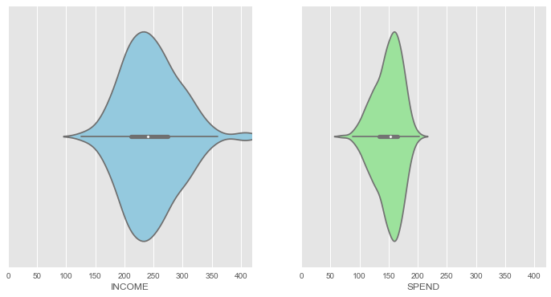
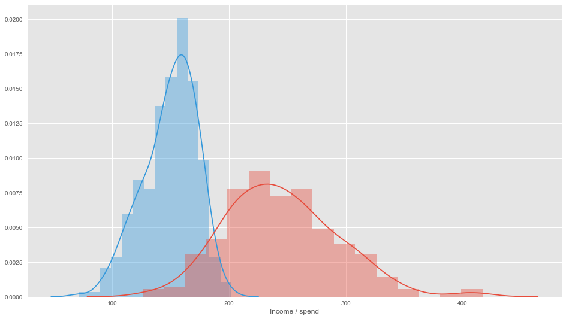
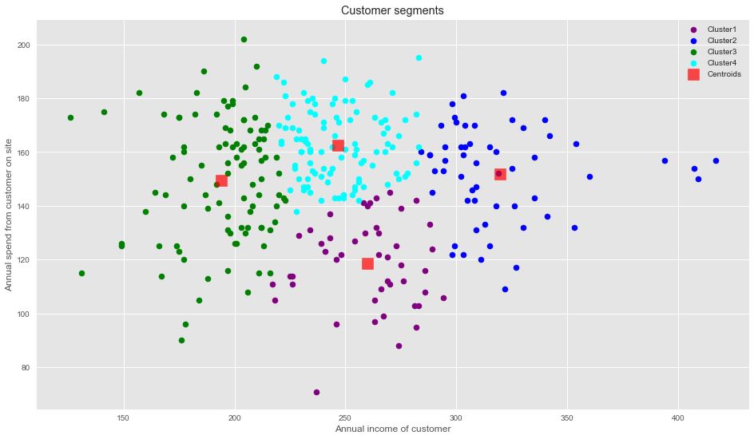
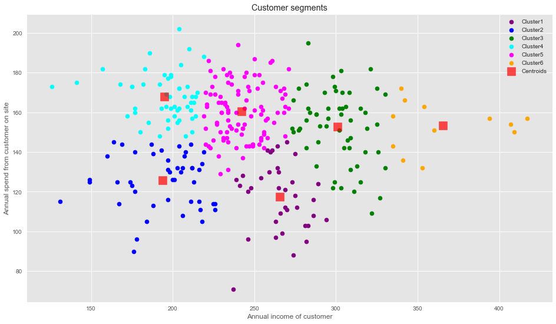

# Customer Segmentation with K-Means Clustering

## 📋 Project Description

This project implements a **K-Means Clustering** algorithm to perform customer segmentation based on annual income and annual spending. The goal is to identify different customer groups to develop personalized marketing strategies and improve customer experience.

## 🎯 Objectives

- Segment customers into homogeneous groups using income and spending data
- Determine the optimal number of clusters using the Elbow Method
- Visualize identified customer segments
- Propose specific marketing strategies for each segment

## 📊 Dataset

The project uses a CSV file named `CLV.csv` containing the following columns:
- **INCOME**: Customer's annual income
- **SPEND**: Customer's annual spending on the website

## 📸 Project Visualizations

### Income Distribution


### Spending Distribution


### Income vs Spending Analysis


### Elbow Method for Optimal Clusters


### Final K-Means Clustering Results


## 🛠️ Technologies and Libraries

### Main Libraries
- **NumPy**: Numerical operations and array handling
- **Pandas**: Data manipulation and analysis
- **Scikit-learn**: K-Means algorithm implementation
- **Matplotlib**: Data visualization
- **Seaborn**: Advanced statistical visualizations

### Required Dependencies
```bash
pip install numpy pandas matplotlib seaborn scikit-learn
```

## 🚀 Installation and Setup

1. **Clone the repository**:
   ```bash
   git clone <repository-url>
   cd customer-segmentation-kmeans
   ```

2. **Install dependencies**:
   ```bash
   pip install -r requirements.txt
   ```

3. **Ensure the dataset file `CLV.csv` is in the project directory**

4. **Run the script**:
   ```bash
   python k_means_clustering_algorithms_for_customer_segmentation.py
   ```

## 📈 Project Workflow

### 1. Data Exploration
- Load and examine the dataset structure
- Generate descriptive statistics
- Create distribution plots for income and spending
- Use violin plots to visualize data distribution

### 2. Optimal Cluster Selection
- Apply the **Elbow Method** to determine optimal number of clusters
- Test clusters from 1 to 10
- Calculate Within-Cluster Sum of Squares (WCSS) for each k value
- Plot elbow curve to identify the optimal k

### 3. Model Implementation
The project compares two different cluster configurations:

#### K=4 Clusters
- **Cluster 1**: Medium income, low annual spend
- **Cluster 2**: High income, medium to high annual spend  
- **Cluster 3**: Low income customers
- **Cluster 4**: Medium income, high annual spend

#### K=6 Clusters (Recommended)
- **Cluster 1**: Medium income, low annual spend
- **Cluster 2**: Low income, low annual spend
- **Cluster 3**: High income, high annual spend
- **Cluster 4**: Low income, high annual spend
- **Cluster 5**: Medium income, medium annual spend
- **Cluster 6**: Very high income, high annual spend

### 4. Visualization
- Scatter plots showing customer distribution across clusters
- Color-coded clusters with centroids marked
- Clear legends and axis labels for interpretation

## 🎯 Marketing Strategies by Segment

Based on the 6-cluster segmentation, here are the recommended marketing strategies:

### 🏆 High-Value Customers (Clusters 3 & 6)
- **Strategy**: Premium promotional campaigns and exclusive offers
- **Focus**: Retention and increased engagement
- **Tactics**: VIP programs, early access to products, personalized service

### 💎 Loyal Budget Customers (Cluster 4)
- **Strategy**: Loyalty-based discount programs
- **Focus**: Retention through value-based offers
- **Tactics**: Discounted pricing, loyalty rewards, flexible payment options

### 📊 Low Engagement Customers (Cluster 2)
- **Strategy**: Price-sensitive campaigns and engagement analysis
- **Focus**: Understanding barriers to spending and conversion
- **Tactics**: Market research, competitive pricing, targeted promotions

### 🔍 Underutilized Potential (Cluster 1)
- **Strategy**: Satisfaction analysis and visibility improvement
- **Focus**: Understanding why high-income customers spend less
- **Tactics**: User experience research, personalized recommendations, enhanced marketing visibility

### ⚖️ Balanced Customers (Cluster 5)
- **Strategy**: Maintain engagement and encourage growth
- **Focus**: Gradual increase in spending through targeted offers
- **Tactics**: Cross-selling, upselling, seasonal promotions

## 📊 Key Features

- **Automated cluster selection** using the elbow method
- **Multiple cluster configurations** for comparison
- **Comprehensive visualizations** with clear segment identification
- **Business-ready insights** with actionable marketing strategies
- **Scalable approach** that can be adapted to different datasets

## 🔧 Algorithm Parameters

### K-Means Configuration
```python
KMeans(
    n_clusters=6,           # Number of clusters
    init='k-means++',       # Smart centroid initialization
    max_iter=300,          # Maximum iterations
    n_init=10,             # Number of runs with different seeds
    random_state=0         # Reproducible results
)
```

## 📁 File Structure

```
project/
│
├── k_means_clustering_algorithms_for_customer_segmentation.py
├── CLV.csv
├── requirements.txt
├── README.md
└── outputs/
    ├── elbow_plot.png
    ├── clusters_k4.png
    └── clusters_k6.png
```

## 📋 Requirements

Create a `requirements.txt` file with:
```
numpy>=1.21.0
pandas>=1.3.0
matplotlib>=3.4.0
seaborn>=0.11.0
scikit-learn>=1.0.0
```

## 🤝 Contributing

1. Fork the repository
2. Create a feature branch (`git checkout -b feature/AmazingFeature`)
3. Commit your changes (`git commit -m 'Add some AmazingFeature'`)
4. Push to the branch (`git push origin feature/AmazingFeature`)
5. Open a Pull Request

## 📄 License

This project is licensed under the MIT License - see the [LICENSE](LICENSE) file for details.

## 👥 Authors

- **Guyen Soto** - *Initial work* - [GuyenSoto](https://github.com/GuyenSoto)

## 🙏 Acknowledgments

- Scikit-learn documentation for K-Means implementation
- Seaborn and Matplotlib for visualization capabilities
- The open-source community for continuous improvements

## 📞 Support

If you have any questions or issues, please:
- Open an issue on GitHub
- Contact: guyensotowong@gmail.com